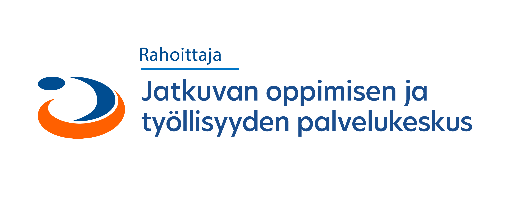

# Johdanto konttiteknologiaan (Docker)

Tämä on Seinäjoen ammattikorkeakoulun toteuttaman ohjelmistosuunnitteluhankkeen aikana luotu johdantomateriaali konttiteknologioihin kuten Docker ja Kubernetes. Hankkeen rahoittajana toimi jatkuvan oppimisen ja työllisyyden palvelukeskus Jotpa.

Varsinainen materiaali löytyy [täältä.](docker.md)

